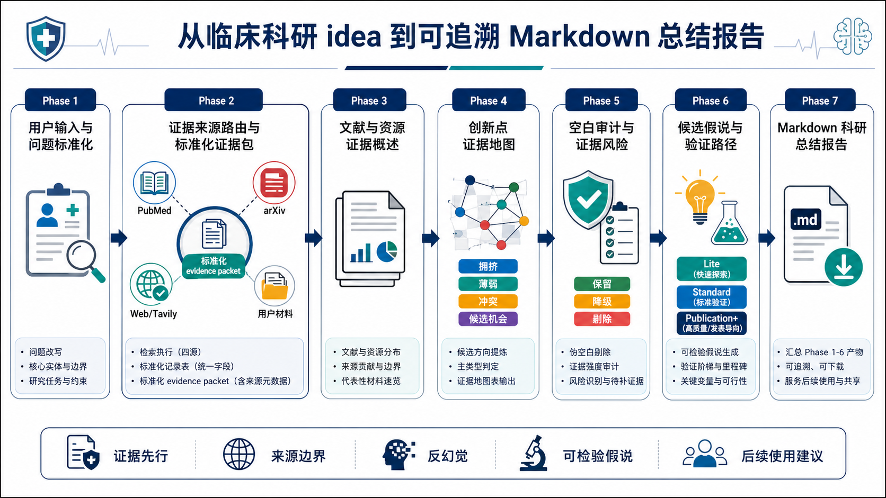

# clinical-research-hypothesis-miner 参赛作品介绍

## 一、场景描述

医学科研选题常常从一个模糊 idea 开始，例如“我想研究脓毒症相关急性肾损伤，但不知道具体做什么”。此时研究者通常面临三个困难：问题边界不清、证据来源分散、创新点判断容易依赖直觉。

本 Skill 面向临床与基础医学科研早期选题场景，帮助用户将疾病、机制、标志物、药物靶点、多组学或 AI for Science 方向，转化为可检索、可审计、可验证的科研问题。它通过 PubMed 医学文献、arXiv 方法学线索、Web/Tavily 官方资源核验以及用户提供材料，构建可追溯证据链，再进一步形成文献概述、创新点证据地图、研究空白审计、候选假说和 Markdown 科研总结报告。

## 二、需求分析

用户的核心需求不是“生成一个看起来新颖的课题”，而是获得一条可靠的科研推理链路：

1. 从模糊输入中识别疾病、实体、终点、对象和边界。
2. 将不同来源的证据统一整理为可复用的标准化证据包。
3. 区分 PubMed、arXiv、Web/Tavily 和用户材料的不同证据职责。
4. 避免把弱来源、网页线索或用户材料误写成强医学证据。
5. 从证据分布中提炼候选创新方向，而不是直接幻想创新点。
6. 对候选方向进行伪空白剔除、证据强度审计和风险识别。
7. 将保留或降级后的研究空白转化为可检验假说与验证路径。
8. 最终生成一份可保存、可下载、可追溯的 Markdown 科研总结报告。

## 三、Skill 拆解

这个 Skill 被拆成 7 个 Phase，每个 Phase 对应一个 reference md 文件，形成“输入标准化 -> 证据采集 -> 证据概述 -> 创新地图 -> 空白审计 -> 假说验证 -> 总结报告”的流水线。

| 阶段 | 对应文件 | 核心作用 | 阶段产物 |
|---|---|---|---|
| Phase 1 | `input-question-standardization.md` | 解析用户输入，标准化研究问题和实体边界 | 标准化问题、核心实体、歧义与待补信息 |
| Phase 2 | `evidence-source-routing.md` | 路由 PubMed、arXiv、Web/Tavily 和用户材料，并整理证据包 | 标准化 evidence packet |
| Phase 3 | `evidence-overview.md` | 基于 Phase 2 证据包生成文献与资源概述 | 材料范围、证据分布、来源边界 |
| Phase 4 | `innovation-evidence-map.md` | 从证据分布中提炼候选方向地图 | 拥挤、薄弱、冲突、候选机会 |
| Phase 5 | `research-integrity-rules.md` | 审计伪空白、证据强度和主要风险 | 保留、降级、剔除和待补证据 |
| Phase 6 | `hypothesis-and-validation-design.md` | 将审计后的方向转成候选假说和验证路径 | 假说卡片、Lite/Standard/Publication+ 路径 |
| Phase 7 | `research-summary-assembly.md` | 汇总 Phase 1-6 产物，生成 Markdown 科研总结报告 | 可追溯 Markdown report |

## 四、Skill 架构图



图中展示了完整链路：

```text
用户输入 -> 标准化问题 -> PubMed/arXiv/Web/用户材料证据包 -> 文献资源概述 -> 创新点证据地图 -> 空白审计 -> 候选假说与验证路径 -> Markdown 科研总结报告
```

架构图中将 PubMed、arXiv、Web/Tavily、用户材料和 Markdown 报告分别图标化，方便在 PPT 中说明每类来源的职责和整体 Skill 工作流。

## 五、核心设计特点

### 1. 证据先行，而不是自由生成

Skill 不直接根据用户 idea 生成课题，而是先完成问题标准化和证据包整理。所有数量、主题、代表记录、候选方向和假说，都必须能回溯到用户材料或工具返回。

### 2. 多来源分工清晰

PubMed 是医学证据主干，arXiv 负责方法学和预印本线索，Web/Tavily 负责官方资源、数据库、试验注册和网页核验，用户材料则作为用户实际提供内容单独登记。不同来源不能互相替代。

### 3. 分阶段降低科研幻觉

Phase 4 只生成候选方向地图，不判断真实空白；Phase 5 才进行伪空白剔除和证据风险审计；Phase 6 只生成可检验假说和验证路径；Phase 7 只整理总结报告。各阶段职责分离，减少过度推断。

### 4. 输出可复用、可下载

Phase 2 形成标准化 evidence packet，Phase 7 形成 Markdown 科研总结报告。用户可以将这些材料用于导师讨论、补充检索、开题准备、PPT 汇报或后续实验方案设计。

## 六、预期使用效果

在用户只提供一个宽泛医学方向时，本 Skill 可以帮助完成从“模糊想法”到“可追溯科研报告”的转换：

- 明确研究问题和边界；
- 整理 PubMed、arXiv、Web/Tavily 和用户材料；
- 生成文献与资源证据概述；
- 提炼创新点证据地图；
- 审计研究空白和证据风险；
- 形成候选假说和验证路径；
- 输出 Markdown 科研总结报告。

最终产物不是简单问答，而是一套围绕医学科研选题设计的证据链工作流。
